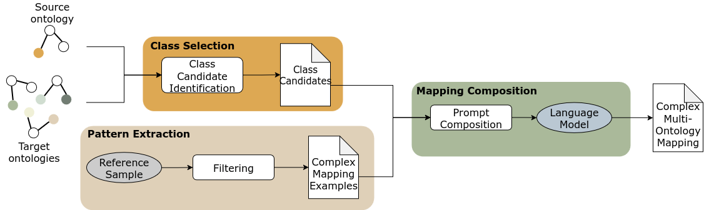

# CMOMgen

CMOMgen is the first end-to-end approach to generate semantically sound and complete complex multi-ontology mappings without any restrictions on the number of target ontologies or entities. It uses In-Context Learning enhanced by Retrieval-Augmented Generation that selects relevant classes and filters reference examples.
We also provide an evaluation metric based on graph edit distance that can evaluate complex mappings in precision, recall, and F-measure.

The following files are shared:
* main.java: Runs the entire pipeline
* run_prompts.py: Prompts chatGPT using its API
* evaluate.py: Evaluates the resulting constructs using our graph edit ditance-based metrics

**Input:** CMOMgen takes as input one source ontology and any number of target ontologies.

**Class selection**: based on [CMOM-RS](https://github.com/liseda-lab/CMOM-RS), combines a lexical approach and a language model approach to find relevant classes to construct the complex mappings

**Pattern extraction**: Filters reference complex mappings to match the selected classes in namespace and cardinality

**Mapping composition**: Prompts a language model using the selected classes and the examples to provide a finalized computer-readable complex mapping.
